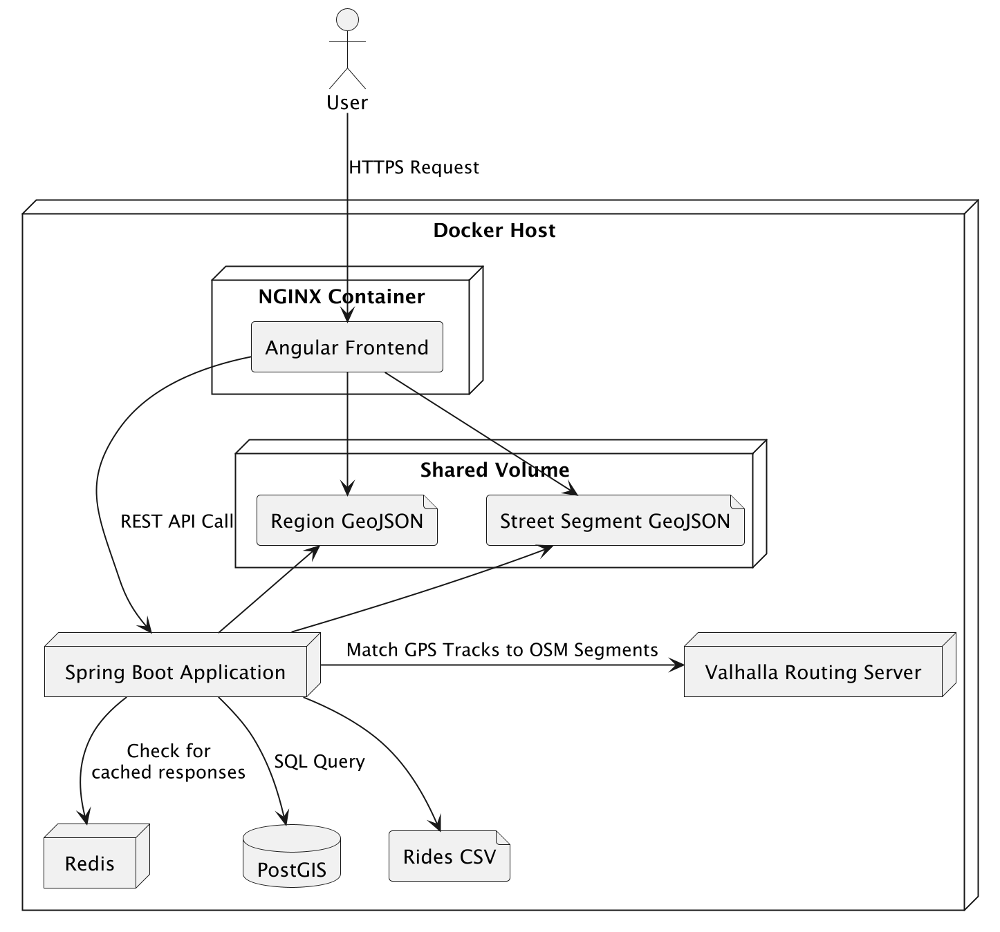

# SIMRA - Sicherheit im Radverkehr
The backend application for the SIMRA dashboard to analyze bicycle safety with crowdsourced ride and near miss data.

<!-- TABLE OF CONTENTS -->
<details>
  <summary>Table of Contents</summary>
  <ol>
    <li>
      <a href="#about-the-project">About The Project</a>
    </li>
    <li>
      <a href="#getting-started">Getting Started</a>
      <ul>
        <li><a href="#prerequisites">Prerequisites</a></li>
        <li><a href="#deploying">Depolying</a></li>
        <li><a href="#development">Development</a></li>
      </ul>
    </li>
    <li><a href="#apps">Apps</a></li>
    <li><a href="#modules">Modules</a></li>
    <li><a href="#architecture-overview">Architecture Overview</a></li>
    <li><a href="#contact">Contact</a></li>
    <li><a href="#acknowledgments">Acknowledgments</a></li>
  </ol>
</details>

# About The Project

SIMRA is a data-driven platform for improving cycling safety by analyzing crowdsourced ride and near-miss incident data. The project identifies high-risk areas, evaluates urban cycling infrastructure, and provides actionable insights to enhance cyclist safety.

By reporting dangerous situations and contributing ride data, users help create a safer cycling environment. The platform visualizes traffic patterns and risk areas, empowering communities and urban planners to make informed decisions.

# Getting Started

## Prerequisites

Before you begin, ensure you have the following installed on your local machine:

- Docker: [Install Docker](https://docs.docker.com/get-docker/)
- Docker Compose: [Install Docker Compose](https://docs.docker.com/compose/install/)

1. Clone the repository:
    ```sh
    git clone https://github.com/simra/result-viewer-backend
    ```
2. Edit environment variables in .env use the .env.example as a template

## Deploying
To deploy and explore the application, you can use Docker Compose to set up the necessary services.

1. Run the following command to start the services:
   ```sh
   docker compose up
   ```

2. Access the api of the application at `http://localhost:3000`.


## Development
To set up the development environment, ensure you have Java installed and follow these steps:

1. Init database service
```shell
docker compose up init-postgis
```

2. Spin up database, cache and routing engine
```shell
   docker compose up postgis redis valhalla
```
3. Run the spring boot application

```shell
./gradlew bootRun
```

# Apps

| Name      | Path                       | Description                 |
| --------- |----------------------------| --------------------------- |
| `backend` | [src/main/java](src/main/java/com/simra/konsumgandalf/backend) | The backend of the platform |

# Modules

The spring project is structured into several modules, each responsible for specific functionalities. 

| Name        | Path                                                                   | Description                                                                                                                                                                                               |
|-------------|------------------------------------------------------------------------|-----------------------------------------------------------------------------------------------------------------------------------------------------------------------------------------------------------|
| `osmPlanet` | [osmPlanet](osmPlanet/src/main/java/com/simra/konsumgandalf/osmPlanet) | Dedicated to control the entities and service logic of Open Street Map.                                                                                                                                   |
| `profiles`  | [profiles](profiles/src/main/java/com/simra/konsumgandalf/profiles)    | Collects and analyses anonymized user profile data to gain knowledge about the most endangered rider groups.                                                                                              |
| `rides`     | [rides](osmPlanet/src/main/java/com/simra/konsumgandalf/rides)     | Reads the rides of [simra-backend](https://github.com/simra-project/backend), uses the `valhalla` module to connect these to OSM street entities and serves as a mainendpoint to the frontend dashaboard. |
| `valhalla`  | [valhalla](osmPlanet/src/main/java/com/simra/konsumgandalf/osmPlanet)  | Encapsulates the logic that interacts with the routing engine, which maps the GPS traces of the rides to the OSM Street grid.                                                                             |


# Architecture Overview


# Contacts

| Role                   | Name               | Contact                                                                                     |
|------------------------|--------------------|---------------------------------------------------------------------------------------------|
| **Project Supervisor** | David Bermbach     | [TU Berlin Profile](https://www.tu.berlin/3s/ueber-uns/team/prof-dr-ing-david-bermbach)      |
| **Developer**          | David Schmidt      | [Portfolio](https://david.codinggandalf.com) • [LinkedIn](https://www.linkedin.com/in/david-schmidt-berlin/) |

# Resources

| Resource Type               | Description                                                                                                                                        | Link                                                                      |
|-----------------------------|----------------------------------------------------------------------------------------------------------------------------------------------------|---------------------------------------------------------------------------|
| **Project Management**      | Kanban board tracking development progress and tasks                                                                                               | [Simra Project Board](https://github.com/users/KonsumGandalf/projects/11) |
| **System Architecture**     | PlantUML diagrams documenting the system design and component interactions                                                                         | [Architecture Diagrams](documentation/uml)                                |
| **Research & Publications** | Academic research and technical documentation related to the SIMRA initiative (including the foundational master's thesis and future publications) | [Research Documents](documentation/research)                              |
| **Live Demonstration**      | Interactive dashboard showcasing real-time cycling safety analytics                                                                                | [Simra Dashboard](https://simra.codinggandalf.com)                        |

<p align="right">(<a href="#top">back to top</a>)</p>
